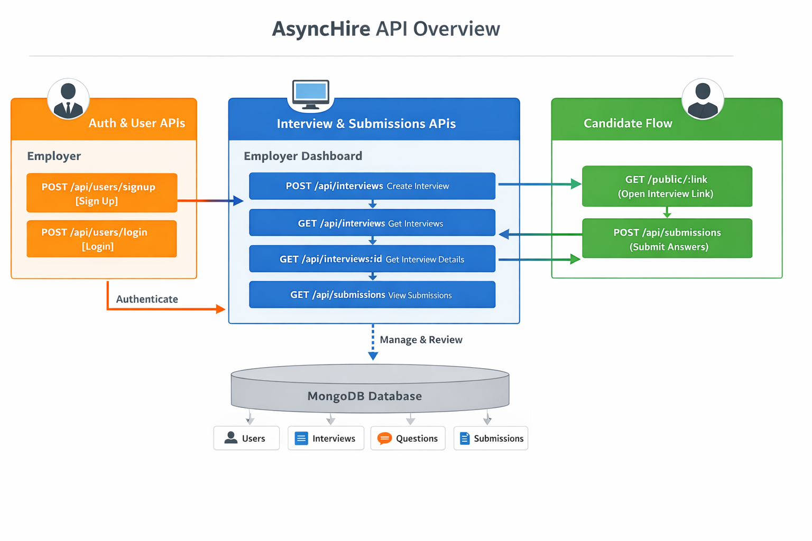

# AsyncHire API Design

This document provides a high-level overview of the AsyncHire REST API. It illustrates how Employers and Candidates interact with the backend and the database.

---

## API Overview Diagram

The diagram below shows the main API endpoints, user flows, and their connection to the MongoDB backend.

---

## Diagram Explanation

### 1. Employer API
- **Sign Up / Login**: Employers authenticate and gain access to the dashboard.
- **Manage Interviews**: Create new interviews and questions.
- **View Submissions**: Access candidate video responses.

### 2. Core Endpoints
- **/api/users**: Handles authentication and employer data.
- **/api/interviews**: Stores interview details and metadata.
- **/api/questions**: Stores questions per interview.
- **/api/submissions**: Stores candidate video answers.

### 3. Candidate Flow
- **Open Interview Link (GET /public/:link)**: Access the interview without logging in.
- **Submit Answers (POST /api/submissions)**: Upload recorded video answers for review.

### 4. Database
- MongoDB collections include:
  - **Users** – Employer accounts
  - **Interviews** – Interview metadata
  - **Questions** – Individual questions per interview
  - **Submissions** – Candidate responses

---

This diagram and explanation provide a clear view of how AsyncHire handles async interviews, from creation to candidate submissions, without exposing any sensitive data.
